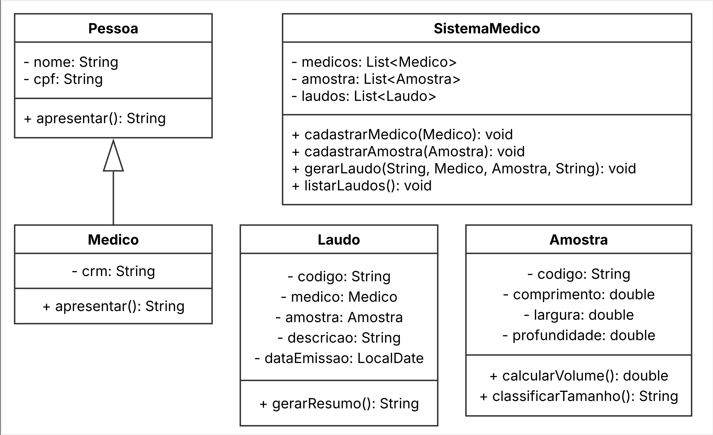

# 🧬 Sistema de Patologia - Dasa

Projeto Java desenvolvido como parte de um desafio acadêmico proposto pela empresa **Dasa**, focado em inovação na área da saúde.

O objetivo é simular um sistema digital para **dimensionamento de amostras de tecidos**, substituindo o processo manual com régua e papel por um fluxo estruturado e orientado a objetos. A solução foca em melhorar a **precisão**, **velocidade** e **rastreabilidade** na geração de laudos médicos.

---

## 🚀 Funcionalidades

- 📌 Cadastro de médicos com nome, CPF e CRM
- 🧪 Cadastro de amostras com comprimento, largura e profundidade
- 🧾 Geração de laudos automáticos com base nas amostras e médicos
- 🧮 Cálculo automático do volume da amostra e classificação (Pequena, Média, Grande)
- 🖥️ Entrada de dados:
    - Modo automático (dados fixos)
    - Modo interativo (via `JOptionPane`)
- ⚠️ Tratamento de exceções com `try-catch` e repetição com `while`

---

## 🧱 Estrutura do Projeto

- **Linguagem**: Java
- **Paradigma**: Programação Orientada a Objetos
- **Pacotes:**
    - `bean` – classes modelo do sistema (Pessoa, Médico, Amostra, Laudo, SistemaMedico)
    - `main` – classe principal de execução (MainSistema)

---

## 💻 Execução

1. Clone o repositório:
   ```bash
   git clone https://github.com/Carti011/sistema-patologia-dasa.git
   
2. Importe no IntelliJ ou outro IDE Java

3. Execute a classe MainSistema

## 📐 Diagrama UML
Visualize abaixo o diagrama de classes UML representando a modelagem do sistema:



## 👨‍💻 Autor
<table> <tr> <td><strong>Weslley Cardoso</strong></td> </tr> <tr> <td> 📧 <a href="mailto:weslleycardoso011@gmail.com">weslleycardoso011@gmail.com</a><br> 🌐 <a href="https://github.com/Carti011" target="_blank">GitHub: Carti011</a><br> 💼 <a href="https://www.linkedin.com/in/seu-usuario" target="_blank">LinkedIn: https://www.linkedin.com/in/weslleycarti/</a> </td> </tr> </table>

### 📜 Licença
Este projeto é de uso educacional e demonstrativo, criado como parte de um desafio acadêmico.
Você pode utilizar, modificar e compartilhar livremente para fins de aprendizado e portfólio.

